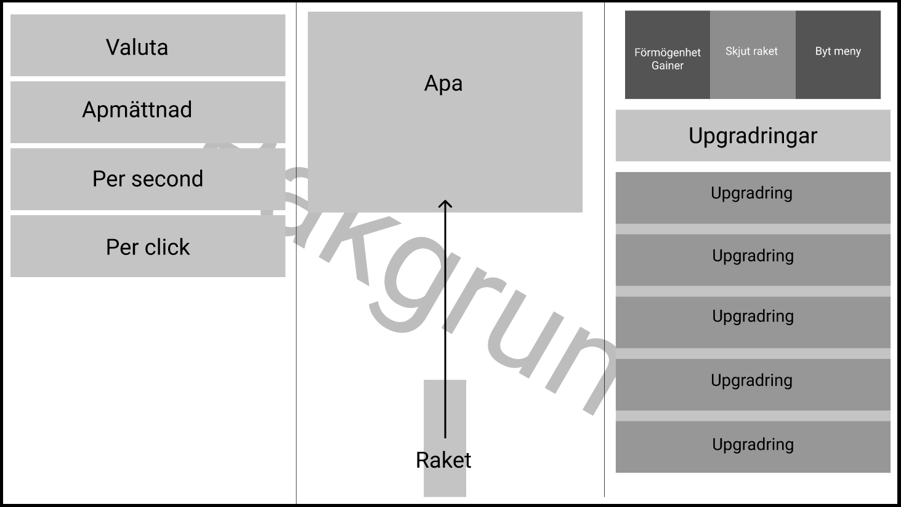

<h1>Intergalactic Ape</h1>
Emil Åsbringer 2021-04-19

<h2>Inledning</h2>
Syftet med detta arbetsmoment var att skapa ett spel med clicker-tema, vilket ger oss elever möjligheter till att förbättra våra Javascript-kunskaper och också utvidga våra designkunskaper på ett nytt alternativt sätt. Detta eftersom vi ofta tidigare jobbade exklusivt med design av webbplatser, med syfte att strukturera information på ett användarvänligt sätt. Speldesign-momentet ger mig som utvecklare ett nytt perspektiv inom utveckling med html/css/javascript. Vi arbetade med html/css/javascript och vi planerade också projektet i en dokument-fil innan vi påbörjade det faktiska arbetet, ibland med figma eller en skiss. Då projektet var klart så skriver vi en post-mortem för att sammanfatta erfarenheterna och tänka kritiskt på vad som kan förbättras. 

<h2>Bakgrund</h2>
Redovisa arbetets olika delar. Så att läsaren förstår vad du gjort och hur.

När vi blev tilldelad uppgiften så skulle vi klona ett Git-repo med en exempel-clicker med syftet att ge oss en javascript-kod som redan fungerar och som vi kan referera tillbaka till under projektets gång. När jag påbörjade mitt projekt så försökte jag först ändra om exempel-clickern så att den passade min design men det blev bara mer problem än det var värt. Istället så tog jag bara bort all html och började om från början. Efter html och det mesta av css var klar så hade jag en bra struktur på sidan som liknade den i min Figma-skiss. Jag lade in mer av knapparna och menyerna i mina kolumner och fick spendera en del tid på att få alla barn-divs att passsa in i huvud-diven och få dem att skala upp och ner på ett mjukt sätt. Då min visuella design var klar så satt jag för det mestadels med javascripten i slutet av arbetsperioden

<h2>Positiva erfarenheter</h2>
Här beskriver du vad som har gått bra i ditt projekt och analyserar varför. Hur ska du upprepa framgångarna.
Strukturen av min kod och hemsida tycker jag har utvecklats väldigt positivt när man jämför med tidigare projekt. Detta är på grund av att jag från början har en plan på vilka delar hemsidan kommer att vara uppdelad i så att jag kan skapa en sammanhängande html-kod som blir lätt att arbeta med. Till skillnad från när man gör saker utan en riktig plan, vilket kan leda till att man ångerar sig eller ser att man har gjort fel och då behöver man flytta om hela sin html-kod, vilket kan vara både tidskrävande och minska ditt arbetes generella effiktivitet.

Något som gick mycket bättre i detta projekt var responsiviteten, antagligen en konsekvens av att jag hade en välstrukturerad logisk html-kod vilket gjorde det lättare att manipulera mina divs med css så att de skalar upp och ner utan att göra något oväntat. Jag hade också en grundläggande plan hur jag tänkte mig att hemsidan borde skalas.

I framtida projekt borde jag alltid ha en sketch att utgå ifrån och ha en konkret plan för hur jag ska koda html/css/javascript eftersom att bara koda utan mål kanske är bättre kortsiktigt men i längden så kommer effiktiveten av ditt arbete försämras märkbart. Att spendera 5% av sin tid att göra en utförlig planering kommer få en att hinna mer på 95% av sin resterande arbetstid än om man bara försöker jobba 100% utan någon planering eller något mål.

<h2>Negativa erfarenheter</h2>
Här beskriver du det som du anser har gått mindre bra med ditt projekt och analyserar hur du kan undvika detta i framtida projekt.
Något som gav upphov till några hinder var animationerna till min clicker. Det var lätt att få dem att se ut som man vill men den svåra delen är att få sin animation att skala bra på olika upplösningar. Jag hade inte planerat så väl hur min animation skulle skala, jag tänkte mest på att få den att fungera och inte så mycket på att den ska vara skalbar. Som jag fick lära mig så går det inte bara att sätta distansen på animation till en % av viewwidth eftersom clickern är för dynamisk för att stödja en så enkel rensponsiv regel. För att undvika detta så krävs det en kreativt planering i förväg på hur animationerna ska skalas eller kraftfullare verktyg som låter animationerna bli manipulerade lättare. T.ex animationer med javascript istället för @keyframes css. 

<h2>Sammanfattning</h2>
Sammanfattningsvis skulle jag säga att den bästa erfarenheten detta projekt har gett mig är en utökad förstålse för vikten av att planera sitt projekt utförligt innan man börjar arbeta. Det kanske fungerar att bara köra på när man gör små skolprojekt som använder sig av elementära uppgifter, men då projeken blir större är det helt enkelet mer effektivt att avsätta en del av tiden för planering och sedan arbeta effektivt istället för att arbeta fler timmar fast med en lägre grad effektivitet. 

Utvecklingsmöjligheterna för mitt projekt kändes inte hindrad av en tidsbegränsning utan istället så var det min bristande kunskap inom javascript och css som straffade arbetet. Att vara bekväm med verktygen som man kommer använda redan under planeringsprocessen är av stor vikt för att skapa en planering som har tagit i åtanke styrkorna och begrännsningarna av sina arbetsverktyg. Eftersom jag inte hade jobbat med javascript innan detta projekt så var det svårt att sätta mål för mig själv på vad jag ville uppnå och var jag ville lägga ner mindre energi.

Javascript-aspektet av denna uppgift har get mig en väldigt bra utgångspunkt från vars jag kan basera framtida uppskattningar om mina förmågor i framtida applikationer som använder sig av javascript. Detta kopplat med den ytterligare bekvämligheten inom CSS som jag har inkasserat från detta projket har gett mig förutsättningarna för att skapa designer som är ännu mer användarvänliga, komplexa och innovativa.
 
